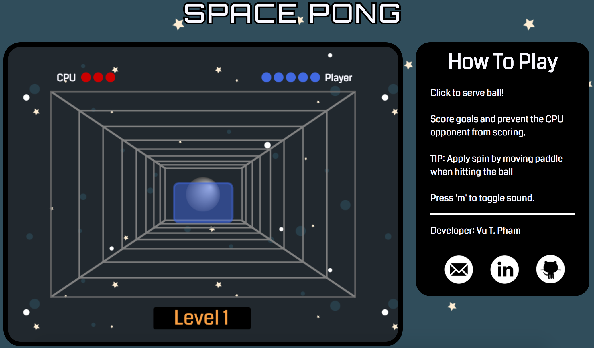

# Space Pong

[LIVE LINK](https://vutpham.github.io/space-pong/)

Space Pong is an adaptation of Curveball, a three-dimensional version of the classic pong game. It is written in pure JavaScript and HTML. The original version of the game can be found here:  http://www.curveball-game.com/



## Instructions

The objective of the game is to score as many points on your opponent as possible, given 5 lives. Levels progress after every three goals against your opponent.  By moving your cursor when the ball hits your paddle, you can apply spin to the ball to make it more challenging for your opponent to respond.

In order to start playing, click on the ball and move your paddle around to prevent the CPU player from scoring.


## Technology/Languages Used

Pong 3D is written in plain Vanilla Javascript and the game pieces (playing field, ball, and paddles) were created using the Easel.js API.

Technologies Used:

- `Plain Vanilla Javascript`
- `HTML5 Canvas`
- `Easel.js`
- `CSS3`

### Easel.js

#### Object Creation

```javascript
//ball.js
draw() {
  this.fillCommand = this.shape
    .graphics
    .beginRadialGradientFill(["#FFF","#383d3a"], [0, 1], 15, -15, 0, 0, 0, 35).command;
  this.silverGradient = this.fillCommand.style;
  this.shape.graphics.drawCircle(0, 0, INITIAL_RADIUS);

  this.stage.addChild(this.shape);
}
```

#### Ticker Object

The Ticker is provided by Easel.js and updates the game objects at a rate of 60 FPS.  With an object constantly ticking in the background, we can constantly update the 'distance' property on our screen in order to scale the ball and the ball tracker.  After starting the game, the ticker object continuously ticks until the either the Player or CPU loses the round.

```javascript

// field.js
this.ticker = createjs.Ticker;
this.ticker.setFPS(60);
this.ticker.addEventListener('tick', this.moveBall.bind(this));
```

#### 3d Rendering

```javascript
// ball.js

updateDistance() {
  const ball = this.stage.getChildByName('ball');

  if (ball.direction === "out") {
    ball.distance += 1;
  } else {
    ball.distance -= 1;
  }
}
```

At maxDistance, the ball is scaled to 1/4 of its original size:

```javascript
// ball.js
scaleBall() {
  this.shape.scaleX = 1 - this.distance * 3 / (4 * this.maxDistance);
  this.shape.scaleY = 1 - this.distance * 3 / (4 * this.maxDistance);

  this.radius = 35 * this.shape.scaleX;
}
```

#### Spin and Curving
Spin is applied whenever the paddle hits the ball. Capturing the start and ending coordinates allows us to apply the intensity of the spin to the ball to the velocity and scale it with distance.

```javascript
getSpin() {
  const ball = this.stage.getChildByName('ball');
  const playerPaddle = this.stage.getChildByName('playerPaddle');


  ball.xSpin += playerPaddle.x - playerPaddle.prevX;
  ball.ySpin += playerPaddle.y - playerPaddle.prevY;

}

addSpin() {
  const ball = this.stage.getChildByName('ball');
  ball.rotation += 8;
  ball.xVelocity -= ball.xSpin / MAX_DISTANCE;
  ball.yVelocity -= ball.ySpin / MAX_DISTANCE;
}
```

#### CPU AI
The CPU AI tracks the ball's position by comparing the ball's and paddle's position.  The CPU paddle makes up 1/25 of the distance between it and the ball.

In the future, when levels are added, the distance between the CPU paddle and the ball would lessen.

## Future Implementations

- [ ] PvP Features using websocketting
