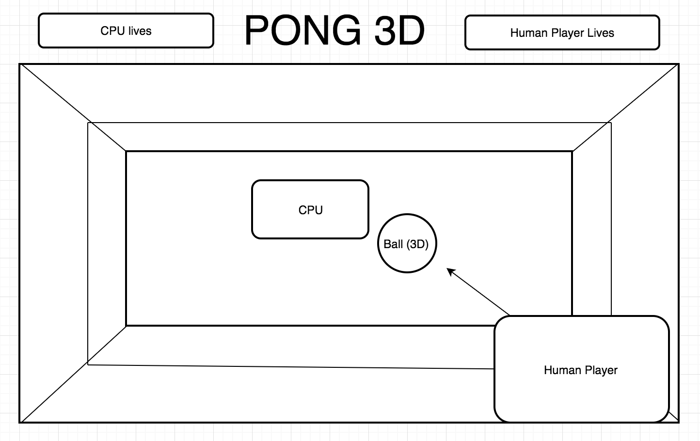

# Pong 3D Proposal

## Background
Pong 3D is a JavaScript clone of Curveball and a 3D version of the game Pong. It features a 3D field and allows players to interact with a ball and an opponent paddle in order to score a goal.

## Functionality and MVP
At minimum, players should be able to:

- [ ] See modal with game introduction and a 'play' button
- [ ] Move 'human player' paddle in close 2-D space
- [ ] Interact with 'CPU' paddle (AI) in far 2-D space
- [ ] Play until one player loses all 3 lives

The project will also include:
- [ ] Production Readme

## Wireframes

## Architecture and Technologies
This project will be implemented with the following technologies:

- Vanilla Javascript for game physics computations
- `HTML5 Canvas` to create playing field and game pieces (ball and paddles)
- CSS for styling game display
- Webpack to bundle the various scripts

In addition to webpack entry file, the following scripts will be used:

`game.js`: This script will hold the game logistics such as the ball starting position, calculating ball velocity and scoring.

`field.js`: This script will be responsible for creating, updating and rendering the playing field, ball, and paddles.

`cpu.js`: This script will track the ball position and move the CPU paddle accordingly.

## Implementation Timeline
**Day 1**: Create ball, paddle, and playing field using HTML 5. Add an event listener to allow the player's paddle to track the cursor. The ball should change size based on its distance from the far and near ends of the playing field.

**Day 2**: Implement game physics to scale the ball size and distance, as well as speeding up and curving the ball based on player interaction. Ball should be able to bounce off the Player/CPU paddles as well as the walls around the playing field.

**Day 3** Create AI for CPU paddle. CPU should be able to track ball and move the paddle towards the ball position.

**Day 4** Add start screen, scoring system, and styling to the game

## Bonus
- [ ] Sounds
